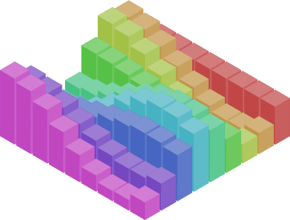

# purescript-isometric

An isometric drawing library for PureScript.

**Features**:
- Basic shapes: cube, prism, cylinder, cone, pyramid
- Extrusions from 2D paths
- Scaling, Translation, Rotation
- Depth sorting

[**Live demo**](http://sharkdp.github.io/purescript-isometric/)



## Build tests

~~bower install~~
~~pulp build -O -m Test.Main -I test -t html/main.js~~

```
$ spago build
$ spago bundle-app -m Test.Main -t html/main.js --path test/**/*.purs
```
if `[error] Failed to find esbuild...` then:
```
$ npm i -g esbuild
```
Then, open `html/index.html` in a browser.
